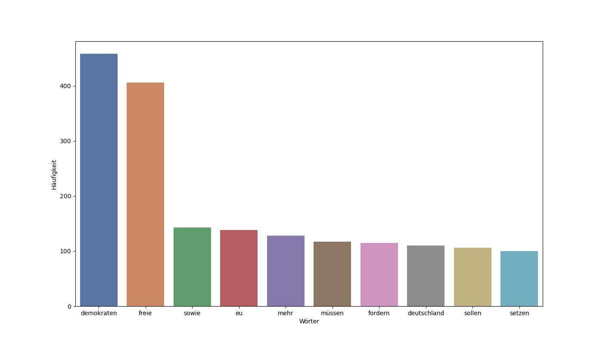
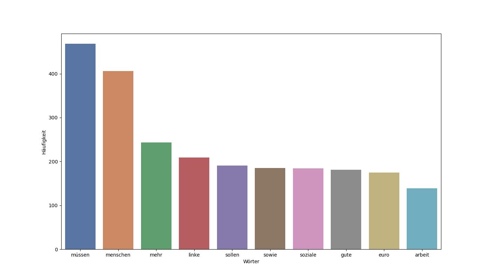
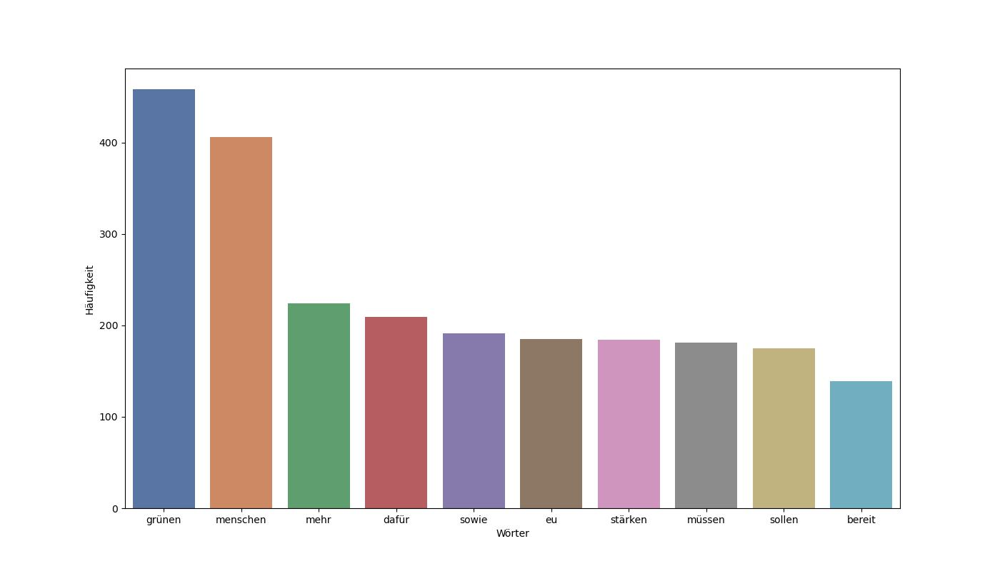

# NLP


## Gruppe:
- Niclas Cramer (7607733)
- Niklas Koch (6699912)
- Michel Medved (9303634)
- Jan Neifeld (8722662)
- Constantin Rech (8028907)
- Luis Steinert (2617416)

## Ziel 
Wahlprogramme zu Bundestagswahlen sind sehr umfangreich und enthalten viele Informationen zu unterschiedlichsten Themenbereichen. Ziel dieses Projektes ist es eine End-to-End OCR NLP Pipeline zu erstellen, die lediglich die Wahlprogramme als PDF Dateien für die NLP Analyse benötigt. Mit Hilfe von OCR wird der Inhalt der Wahlprogramme in Text umgewandelt, welcher anschließend bei der NLP Analyse verwendet wird. Die Analysen beinhalten unter anderem die Gewichtung von Themen innerhalb der einzelnen Wahlprogramme sowie Vergleiche zwischen den einzelnen Parteien. 

## Vorgehensweise
### 0) Installieren
Erstellen der Conda umgebung via:
``` Erstellen der Conda umgebung via:
conda env create -f environment.yml
```

### 1) Installation der Tesseract OCR Engine
Für die NLP Analyse von Wahlprogrammen via PDF Dateien wird zunächst ein OCR engine benötigt. Für die OCR wurde Tesseract als OCR Engine verwendet (https://github.com/tesseract-ocr/tesseract/tree/main). Für die Installation von Tesseract-OCR folge dem User Manual für das entsprechende OS.
<br>
<br>
(https://pyimagesearch.com/2021/08/16/installing-tesseract-pytesseract-and-python-ocr-packages-on-your-system/).
<br>
<br>
Wichtiger Hinweis!
<br>
Während der Installation von Tesseract-OCR wird nach zu installierenden Komponenten bzw. Sprachpaketen gefragt. Hier muss bei den Sprachen German als zusätzliches Sprachpaket gewählt werden, da deutsche Wahlprogramme analysiert werden. Nach der Installation müsste sich in dem Ordner "Tesseract-OCR/tessdata" eine Datei mit dem Namen "deu.traineddata" befinden (siehe Screenshots).
<br>
<br>

<br>
<br>

### 1.1) OCR Text Extraction aus PDF Dateien [~ 3h Laufzeit]
Der Ordner "input" enthält die einzelnen Wahlrprogramme der sechs größten Parteien für die Bundestagswahl 2021 (bereits im Ordner angelegt). Dieser Ordner dient als Ausgangspunkt für die gesamte OCR NLP End-to-End Pipeline. Setze als nächstes den entsprechenden vollständigen Pfad des input Ordners in dem jupyter Notebook "1_OCR_Preprocessing" ein (siehe Bild) und starte das Notebook nach der Installation aller notwendigen Pakete, die in der Datei requirements.txt angegeben sind. 
<br>
<br>

<br>
<br>
Während des Durchlaufs des 1_OCR_Preprocessing notebooks wird für jedes Wahlprogramm bzw. für jede PDF Datei ein separater Ordner angelegt. Die verschiedenen PDF Dateien werden entsprechend segmentiert und die einzelnen Bilder (ein Bild pro Seite im PDF Dokument) werden in den jeweiligen Ordner gespeichert. Die erstellten Ordner mit den einzelnen Bilddateien werden anschließend verwendet, um mit Hilfe von pyTesseract-OCR den Text aus den einzelnen Seiten zu extrahieren. Die einzelnen extrahierten Texte pro Seite werden anschließend zusammengefügt und als .txt Datei gespeichert. Diese generierten .txt Dateien werden im Anschluss bereinigt und nach Bereinigung für die verschiedenen Textklassifikationsmodelle verwendet. Zusätzlich werden für jede PDF Datei neben der .txt Datei auch eine bereinigte .csv Datei generiert, die die einzelnen OCR detektierten Wortobjekte enthält inklusive der Koordinaten der gelesenen Bilder.  


### 2) NLP Modelle

#### Latent Dirichlet Allocation (LDA)
Um die Inhalte der unterschiedlichen Klassen zu analysieren, wurde im ersten Schritt analysiert, ob die Klassen Wirtschaft, Klima, Bildung, Gesundheit, Wissenschaft, soziale Ursachen, Politik und Ideologie, Infrastruktur eine mögliche Abbildung der Texte möglich sind. Daher wurde die inhaltliche Struktur der Texte betrachtet.

#### Textklassifikation mit Hand-Crafted-Words:
In der Datei topic_g.yml wurden Wörter definiert, welche auf eine Klasse verweisen und die Grundlage bilden für die Zuordnung von Texten zu einer Klasse. Hierbei wird jene Klasse verwendet, welche basierend auf der höchsten Anzahl an zutreffenden Wörtern vorhanden ist.

#### Textklassifikation mit Hugging Face
Mithilfe des Modells: *MoritzLaurer/mDeBERTa-v3-base-mnli-xnli* kann eine Klassifizierung der obengenannten Klassen durchgeführt werden und die Texte basierend auf einem vortrainierten Modell zugewiesen werden. Hierbei wird wie bei den Hand Crafter-Words die wahrscheinlichste Klasse als Primärklasse betrachtet. Jedoch die wahrscheinlichsten 3 Klassen werden zusätzlich ausgegeben. Dies ermöglicht eine bessere Bestimmung von Absätzen zu einem bestimmten Thema.

#### Sentiment Analyse
Sentiment Analyse bestimmt die Stimmung innerhalb eines Satzes, welche wie die Klassifikation von Hugging face behandelt wird und die Wahrscheinlichkeit durch ein vortrainiertes Modell ergibt. Dabei werden die Sätze abermals einzeln bewertet.

#### Hatespeech Analyse
Genauso wie Sentiment Analyse werden die Sätze auf Hatespeech analysiert, dabei muss ein Satz negativ konnotiert sein und Hatespeech aufweisen, um vollständig als Hatespeech klassifiziert zu werden

 

### 3) Visualisierung der Ergebnisse
Auf Basis der Daten denen Sentiment, Hatespeech und Topic zugewiesen wurde können Verteilungen zwischen und innerhalb der Parteien dargestellt werden.
Bei Betrachtung der einzelnen Partei wird eine Themenverteilung erstellt, in der die Häufigkeit der dem Thema zugehörigen Sätze in absoluten Zahlen dargestellt wird.
Hier exemplarisch für die AFD: 
     


Zusätzlich werden die Anteilsverteilungen der Parteien innerhalb der Themen dargestellt. Ebenfalls zu sehen ist der Anteil der verschiedenen Themen in der Gesamtheit der Wahlprogramme.


Eine besondere Betrachtung der als Hatespeech klassifizierten Sätze in Verbindung mit Sentiment verknüpft ermöglicht den Vergleich der Parteien allgemein im Bereich Hatespeech und den Vergleich der einzelnen Themen der Parteien im Bereich Hatespeech.

  

Die abgebildeten Diagramme sind nur Screenshots und können interaktiv im Frontend betrachtet werden.

#### Weitere Visualisierungen

Im Folgenden sind jeweils die 10 häufigsten Worte pro Parteiprogramm als Balkendiagramm dargestellt:
Man kann (vermeintlich) Parteien wie die FDP (wegen dem häufigen Wort "freie"), die SPD (wegen "Parteivostand" auf Platz 10), oder vor allem die AfD mit ihrem sehr nationalen Fokus anhand der häufigsten Wörter erkennen. Bilder bitte anklicken für originale Größe!

##### AfD & FDP:

   

##### SPD &  CDU/CSU:

   

##### Die Linke & Die Grünen:

 


### 4) Evaluation der Ergebnisse
Um die dargestellten NLP-Modelle (aus Abschnitt 2) zu evaluieren, wurde ein Sample beziehungsweise eine Stichprobe über alle Modelle und Parteien gezogen. Die Stichproben wurde dabei gleichverteilt über die gegebenen Topics gezogen und anschließend durch uns annotiert. Die Bewertung der ausgewählten Modelle ist im Notebook eval_Data_Models_Final.ipynb zu finden.


### 5) Summarization
Für das Zusammenfassen von Texten wird u.A. das Modul "sumy" genutzt. Über das Frontend können Texte gezielt zusammengefasst werden. Man kann dabei einstellen, wie viele Sätze die Zusammenfassung maximal haben soll.

---

## Aufrufen des Frontends via Docker

Ordner mit Dockerfile downloaden oder einfach nur das Dockerfile downloaden. **Bitte sicherstellen das Docker auf dem Endgerät installiert ist.** 

Im Terminal in den Ordner wechseln, wo das Dockerfile sich befindet und mit dem folgenden Befehl, dass Docker Image erstellen:
``` Docker
docker build -t frontendnlp .
```

Wenn das Image erstellt ist, wird das Image mit folgendem Befehl ausgeführt:
``` Docker
docker run -p 8501:8501 frontendnlp
```

Nachdem das Image nun läuft, kann im Browser folgender localhost aufgerufen werden:
```
http://localhost:8501
```


### Zu beachten:

Beim erstmaligen Aufruf des Frontend und erstmaliger Ausführung der Modelle, müssen diese erst vom Huggigface Hub runtergeladen werden. Dies könnte je nach Internet Verbindung seine Zeit brauchen. Sobald diese jedoch einmal runter geladen sind, können diese ohne Probleme genutzt werden.

